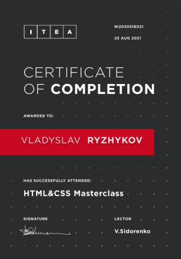

# **Rizhykov Vladyslav**

+ Telegram: [@ryzhy_kot](https://t.me/ryzhy_kot)
+ Phone: [+7 (918) 518-77-81](+79185187781)
+ Email: ryzhy_kot@mail.ru
+ GitHub: [enterIT30](https://github.com/enterIT30)

## JS developer

At the age of 28, he began to study front-end development. Over the course of the year, I am getting closer to my goal, namely to become a front-end developer by the age of 30. Every day I watch video tutorials, read articles, write code. So far, there is no commercial experience, but I feel that it will appear soon. To learn something new, I go through courses all the time.

----

## Skills

+ HTML5
+ CSS
+ JavaScript
+ Git
+ BEM
+ SASS
+ Gulp
+ Figma

----

## Code Example

[](https://www.codewars.com/users/enterIT30)

**[Consecutive items](https://www.codewars.com/kata/5f6d533e1475f30001e47514)**

```javascript
function consecutive(arr, a, b) {
  return (arr.join(' ').indexOf(`${a} ${b}`) == -1 && arr.join(' ').indexOf(`${b} ${a}`) == -1) ? false : true;
}
```
---

## Education

**Donbass State Technical University, Ukraine, Alchevsk**

_Mining engineer(Mineral developer)_

----

## Courses & Certificates




----

## Languages

**Russian** Native language

**English** Beginner/Elementary